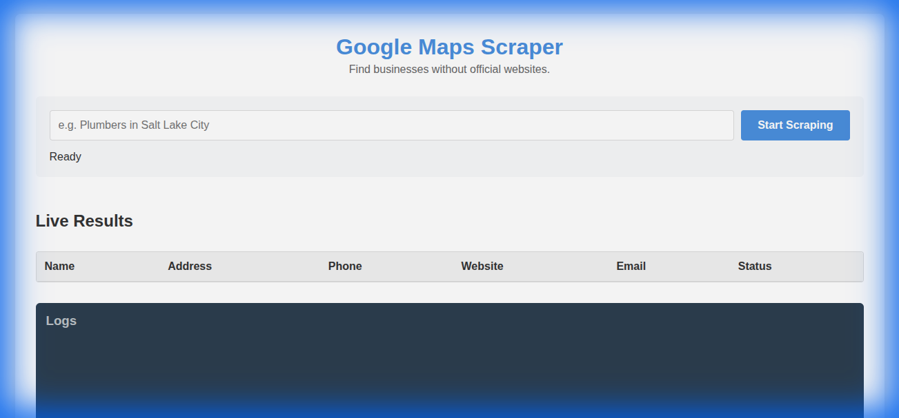
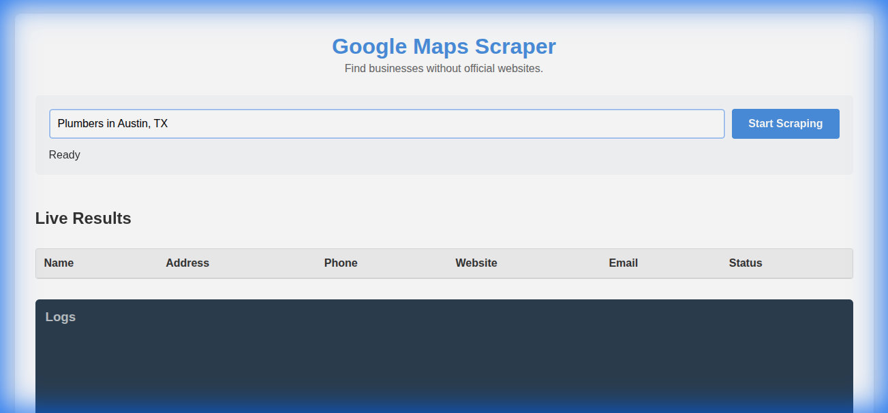

# Needs Website - Google Maps Lead Scraper

**Needs Website** is a powerful, real-time lead generation tool designed to identify businesses that do not have an official website. By scraping Google Maps and verifying digital footprints, it helps agencies and freelancers find high-quality leads who need web development services.



## 🚀 Features

- **Real-Time Scraping:** Live updates via WebSockets as the scraper traverses Google Maps.
- **Smart Verification:** Automatically checks if a business has a website. If a website is listed, it verifies if it's just a directory listing (Yelp, Facebook, etc.) or a real custom domain.
- **Email Extraction:** Visits business websites to extract contact emails automatically.
- **Nearby Search:** Automatically expands the search to nearby cities to maximize lead volume.
- **CSV Export:** Downloads a clean, structured CSV file of all found leads.
- **Visual Interface:** Simple, clean web interface to manage and monitor scraping jobs.

## 🛠️ Technology Stack

This project is built with a modern Node.js stack:

- **Backend:** Node.js, Express.js
- **Real-Time Communication:** Socket.io
- **Browser Automation:** Playwright (Chromium)
- **Frontend:** Vanilla HTML, CSS, JavaScript

## 📦 Installation & Usage

1. **Clone the repository:**

    ```bash
    git clone https://github.com/pnutnam/needs_website.git
    cd needs_website
    ```

2. **Install dependencies:**

    ```bash
    npm install
    ```

3. **Start the server:**

    ```bash
    node server.js
    ```

4. **Open the application:**
    Navigate to `http://localhost:3000` in your browser.

5. **Start Scraping:**
    Enter a query like "Plumbers in Austin, TX" and watch the results roll in.



## 📊 Sample Results

The tool generates a CSV file with the following structure:

| Name | Address | Phone | Website | Email | Status |
|------|---------|-------|---------|-------|--------|
| Legacy Shoe Care | 4112 Legacy Dr #322, Frisco, TX | (469) 362-0000 | [Link](...) | | Official Website |
| The Colony Cobblers | 5201 S Colony Blvd, The Colony, TX | (972) 370-3032 | [Link](...) | | Official Website |
| Joe's Plumbing | 123 Main St, Austin, TX | (512) 555-0123 | | | **No Website** |

## 🔮 Future Improvements

To make this tool even more robust, consider the following enhancements:

- **Headless Mode Toggle:** Add a UI switch to run the browser in headless mode for faster performance on servers.
- **Database Integration:** Store results in a database (SQLite/PostgreSQL) instead of just CSV for better data management and historical tracking.
- **Proxy Support:** Integrate rotating proxies to prevent Google Maps rate limiting during heavy usage.
- **Advanced Email Discovery:** Integrate with APIs like Hunter.io or Snov.io for better email enrichment.
- **Deployment:** Dockerize the application for easy deployment to cloud services like AWS or DigitalOcean.
- **Authentication:** Add a simple login system to protect the tool when deployed publicly.

## 🤝 Contributing

Contributions are welcome! Please feel free to submit a Pull Request.
